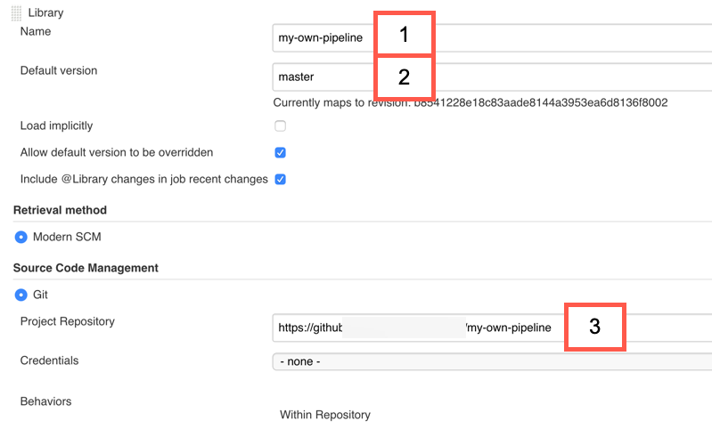

# Extensibility

When using one of the ready-made pipelines project "Piper" provides, the basic idea is to not write custom pipeline code.
The pipelines are centrally maintained, and can be used with a small amount of [configuration](configuration.md).


For the large majority of _standard_ projects, the features of the ready-made pipelines should be enough to implement a production-ready CI/CD workflow in a short mount of time.

This approach allows you to focus on what you need to get done while implementing [Continuous Delivery](https://martinfowler.com/bliki/ContinuousDelivery.html) in a best-practice compliant way.

If a feature you need is missing, or you discovered a bug in one of the ready-made pipelines, please see if there is already an [issue in our GitHub repository](https://github.com/SAP/jenkins-library/issues), and open a new one if that is not the case.

In some cases, specialised features might not be desirable for inclusion in the ready-made pipelines.
You can still benefit from the qualities the ready-made pipelines provide if you can address your requirements via an **Extension**.

Extensions are custom bits of pipeline coding that you can use to implement special requirements.

Before building extensions, please make sure that no better alternative works for you.

Options for extensibility, in order in which we recommend to consider them:

## 1) Extend individual stages

In this option, you use the centrally maintained pipeline, but can change individual stages if required.

To do so, create a file called `<StageName>.groovy` in `.pipeline/extensions/` in your source code repository.

To do so, you need to know the technical identifiers for stage names.

* For the general purpose pipeline, you can find them in [the pipeline source file](https://github.com/SAP/jenkins-library/blob/master/vars/piperPipeline.groovy).
* For SAP Cloud SDK Pipeline, you can find them in [this GitHub search query](https://github.com/SAP/cloud-s4-sdk-pipeline-lib/search?q=%22def+stageName+%3D%22).

The centrally maintained pipeline checks if such a file exists and executes it, if present.
A parameter of type `map` that contains the following keys is passed to the extension:

* `script`: defines the global script environment of the `Jenkinsfile` run. This makes sure that the correct configuration environment can be passed to project "Piper" steps and also allows access to for example the `commonPipelineEnvironment`.
* `originalStage`: this will allow you to execute the "original" stage at any place in your script. If omitting a call to `originalStage()` only your code will be executed instead.
* `stageName`: name of the current stage
* `config`: configuration of the stage (including all defaults)

Here a simple example for such an extension, which you can use as a starting point:

```groovy
void call(Map params) {
  //access stage name
  echo "Start - Extension for stage: ${params.stageName}"

  //access config
  echo "Current stage config: ${params.config}"

  //execute original stage as defined in the template
  params.originalStage()

  //access overall pipeline script object
  echo "Branch: ${params.script.commonPipelineEnvironment.gitBranch}"

  echo "End - Extension for stage: ${params.stageName}"
}
return this
```

!!! note "`return this`"
    Don't forget the `return this` which is required at the end of _all_ extension scripts.


!!! note "Init stage cannot be extended"
    Please note, the `Init` stage among other things also checks out your current repository.<br />Thus it is not possible to use extensions on this stage.

### Practical example

For a more practical example, you can use extensions in SAP Cloud SDK Pipeline to add custom linters to the pipeline.

A linter is a tool that can check the source code for certain stylistic criteria, and many teams chose to use a linter to ensure a common programming style.

As an example, if you want to use [Checkstyle](https://checkstyle.sourceforge.io/) in your codebase, you might use an extension similar to this one in a file called `.pipeline/extensions/lint.groovy` in your project:

```groovy
def call(Map parameters) {

    parameters.originalStage.call() // Runs the built in linters

    mavenExecute(
        script: parameters.script,
        flags: '--batch-mode',
        pomPath: 'application/pom.xml',
        m2Path: s4SdkGlobals.m2Directory,
        goals: 'checkstyle:checkstyle',
    )

    recordIssues blameDisabled: true,
        enabledForFailure: true,
        aggregatingResults: false,
        tool: checkStyle()
}

return this
```

This example can be adopted for other linters of your choice.


## 2) Modified ready-made pipeline

This option describes how you can copy and paste one of the centrally maintained pipelines to make changes not possible otherwise.

This might be done for an individual project (in the `Jenkinsfile`), or in a git repository so it can be used for multiple projects.


### Individual Project

The default `Jenkinsfile` of centrally maintained pipelines does nothing except for loading the pipeline as is.
This is comfortable, but limits what you can modify.
For example, you can't reorder stages, change which stages run in parallel or add new stages.

You can copy and paste the existing Pipelines from those sources into your `Jenkinsfile` and make changes to it

* [piperPipeline](https://github.com/SAP/jenkins-library/blob/master/vars/piperPipeline.groovy)
* [SAP Cloud SDK Pipeline](https://github.com/SAP/jenkins-library/blob/master/vars/cloudSdkPipeline.groovy)

### Multiple projects

Similar to what you can do in an individual `Jenkinsfile`, you can also copy the pipeline to a file in a separate git repository and modify it.

To do this, create a new git repository in your preferred git hosting service.
It must be compliant to how Jenkins shared libraries are built.
Basically this means you need a `vars` directory, inside which you can place a copy of your preferred pipeline.

A minimal example of such a library could look like this

```
./vars/myCustomPipeline.groovy
./README.md
```

where `myCustomPipeline.groovy` contains the modified pipeline code.

This library needs to be placed in a git repository which is available for Jenkins and must be configured in Jenkins [as documented here](https://jenkins.io/doc/book/pipeline/shared-libraries/#using-libraries).



The `Jenkinsfile` would look like

```groovy
@Library('my-own-pipeline') _

myCustomPipeline script: this
```


!!! warning "How to not get decoupled"
    Typically, providing a custom template decouples you from centrally provided updates to your template including the stages.<br />
    Where applicable, you can re-use the stage implementations. This means, you will call e.g. `piperPipelineStageBuild()` as you can see in [piperPipeline](https://github.com/SAP/jenkins-library/blob/master/vars/piperPipeline.groovy).

    Using this approach you can at least benefit from innovations done in individual project "Piper" stages.

!!! note "When to go with a custom template"
    If the configuration possibilities are not sufficient for you and if _1. Stage Exits_ is not applicable.

## 3. Custom `Jenkinsfile`

